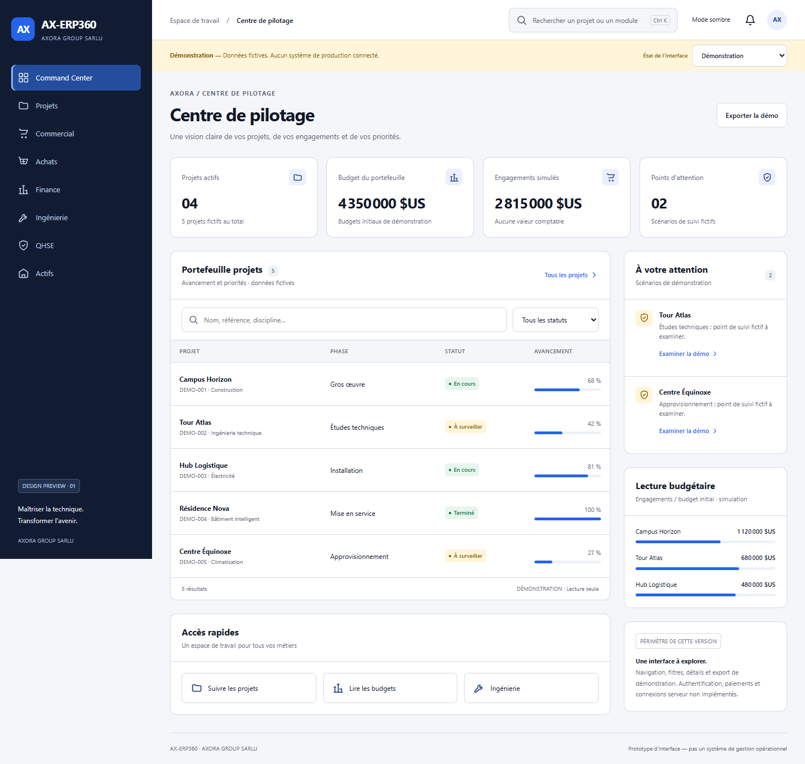
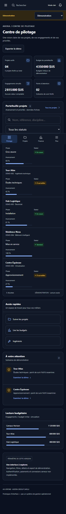

# AX-ERP360 — aperçu fonctionnel de la nouvelle interface

Cette livraison contient une application Next.js dans `apps/web`, pas encore un progiciel de gestion opérationnel. Toutes les valeurs affichées sont fictives. Aucun compte, paiement, chantier ou système de production n'est connecté.

## Démarrer

Prérequis : Node.js 24 et pnpm 11.4.0, conformément au manifeste du dépôt.

```sh
pnpm install --frozen-lockfile --ignore-scripts
pnpm dev:web
```

Ouvrir `http://127.0.0.1:3310/operations` sur la machine qui exécute le serveur. Cette adresse locale ne constitue pas un déploiement public ni un accès iPhone distant.

```sh
pnpm check:web
pnpm --filter @ax-erp360/web exec playwright install chromium
pnpm --filter @ax-erp360/web test:e2e
```

Sous Windows, si pnpm n'est pas disponible globalement, remplacer `pnpm` par `npm.cmd exec --yes pnpm@11.4.0 --`. Pour utiliser Microsoft Edge déjà installé, définir `PLAYWRIGHT_CHANNEL=msedge` uniquement dans le processus de test.

## Périmètre

Le centre de pilotage, le portefeuille de projets et la vue financière proposent une navigation réelle, des filtres, des détails, un export de démonstration, les thèmes clair/sombre et des mises en page adaptées au téléphone. Les états vide, chargement et erreur sont des simulations explicitement indiquées. La recherche utilise le raccourci Ctrl+K ou le bouton de recherche.

Les autres domaines affichent « À venir — non implémenté ». La page de connexion ne collecte aucun identifiant sans adaptateur serveur ; aucun délai artificiel n'est considéré comme une authentification réussie.

## Validation et limites

Le contrôle `check:web` est limité à l'interface. Le contrôle racine `check`, l'interface de programmation applicative (API), Prisma, les migrations, l'authentification réelle, les autorisations serveur et les opérations métier ne sont pas qualifiés par ces tests.

Les tests de bout en bout (E2E, End-to-End) couvrent huit largeurs de fenêtre : 360, 390, 430, 768, 1024, 1280, 1440 et 1920 pixels. Le moteur axe vérifie automatiquement une partie des exigences d'accessibilité ; un résultat sans violation ne constitue pas une certification ni une validation complète avec technologies d'assistance. Safari/iPhone physiques ne sont pas testés.

La configuration de démarrage est `next start`, sans empaquetage autonome `standalone`. Le choix de la racine Next.js est explicite et ne dépend pas des fichiers de verrouillage présents dans le dossier personnel de la machine.

## Captures de l'application exécutée





Ces captures proviennent de tests navigateur réels avec des données fictives. La barre de navigation fixe apparaît à la hauteur de la fenêtre initiale dans la capture mobile pleine page.

## Intégration future

Conserver les règles métier et les interfaces du projet source après audit. Ne pas remplacer ces données fictives par des informations de production sans autorisations serveur, sessions sécurisées, validation, isolation des sociétés et tests de transactions. Ne pas exposer ce serveur local sur Internet comme un produit terminé.
